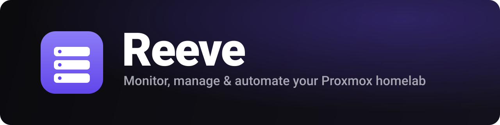
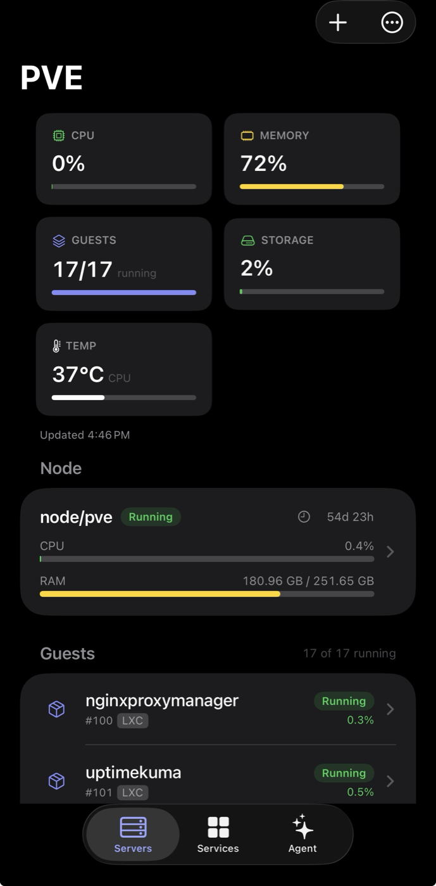
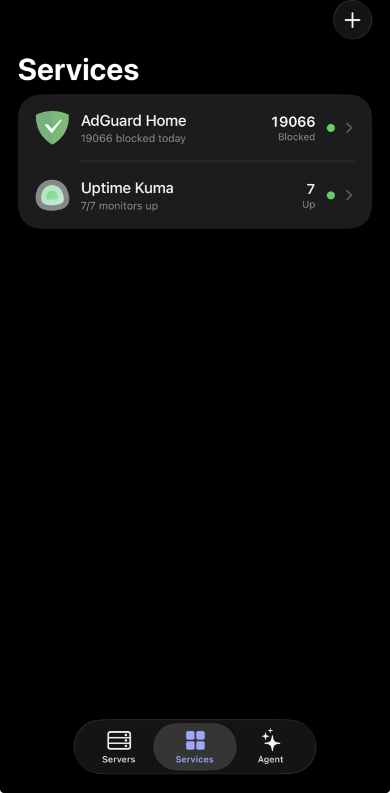
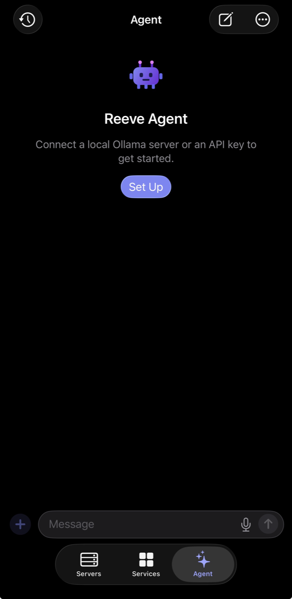

<p align="center">
  
</p>

<p align="center">
  A native <b>SwiftUI</b> app for <b>iOS, iPadOS, and macOS</b> that monitors, manages, and automates a
  <a href="https://www.proxmox.com/">Proxmox VE</a> homelab: nodes, VMs, and containers, with live metrics,
  history charts, and power controls. Add as many servers as you want. Reeve talks directly to the Proxmox
  REST API over your LAN or <a href="https://tailscale.com/">Tailscale</a>.
</p>

> Bring your own server. Point Reeve at your Proxmox host with an API token, and that's it. No cloud, no account, no telemetry.

[](../../actions)


> **Status:** actively developed, not yet on the App Store. Build it from source for now (see below).

## Contents

- [Features](#features)
- [Screenshots](#screenshots)
- [Requirements](#requirements)
- [Getting started](#getting-started)
- [Architecture](#architecture)
- [Testing](#testing)
- [Contributing](#contributing)
- [Privacy & Security](#privacy--security)
- [License](#license)

## Features

**Monitor**
- **Dashboard:** node CPU, RAM, load, and uptime, plus every guest's status. Search runs across all your servers.
- **Live metrics and history charts:** auto-refreshing utilisation, plus CPU, memory, network, and disk-I/O time-series (from an hour up to a year) drawn with Swift Charts.
- **Hardware health:** physical disks with SMART status and SSD/NVMe wear, ZFS pools, node services, and pending package updates.
- **Activity:** a recent task log with per-task logs, and alerts when a task finishes or fails.

**Manage** (replaces most trips to the web UI)
- **Guest lifecycle:** start, stop, reboot, shut down, clone, migrate, delete, convert to template, edit vCPU/RAM, resize disks, set tags and notes, and configure cloud-init.
- **Create** new LXC containers (including PVE 9.1 OCI images) and VMs from scratch.
- **Backups:** run a vzdump now, restore from a backup, and manage scheduled jobs; create, roll back, and delete snapshots.
- **Node ops:** reboot, shutdown, Wake-on-LAN, and start/stop/restart services.
- **Datacenter:** firewall rules, cluster/HA status, users and API tokens, SDN, replication, and a storage browser.

**Beyond Proxmox**
- **Services:** a pluggable monitor for other self-hosted apps (AdGuard Home, Jellyfin, Home Assistant, TrueNAS, the *arr stack, Uptime Kuma status pages, and more). Adding one takes a single file; see [docs/SERVICES_INTEGRATIONS_DESIGN.md](docs/SERVICES_INTEGRATIONS_DESIGN.md).
- **AI Agent:** a chat grounded in your live Proxmox state that can take actions through tools, with an approval gate for anything that changes state. Point it at a local **Ollama** server or any **OpenAI-compatible** endpoint (bring your own key, stored in the Keychain). It streams replies and reasoning, and supports chat history, voice input, and image (vision) input.
- **SSH terminal:** an in-app interactive shell to a node, plus a per-guest console (`pct enter` / `qm terminal`).

**Platform**
- **Alerts:** local notifications for CPU/RAM thresholds, a guest going down, and task completion, with optional push to **Discord**, **Slack**, **Telegram**, or a **webhook**.
- **Widgets and Live Activities:** configurable Home and Lock Screen widgets for any server or service, a Live Activity for running tasks, and an iOS 18 Control Center control.
- **Personalisation:** Face ID / passcode lock, refresh interval, default chart range, and selectable alternate app icons.
- **Network discovery** that scans the local subnet (no Bonjour), **multi-server** support with secrets in the Keychain, **self-signed TLS** handling, and a **macOS menu bar** via `MenuBarExtra`.

## Screenshots

| Dashboard | Services | AI Agent |
| --- | --- | --- |
|  |  |  |

## Requirements

- **Xcode 26** or newer (the project uses file-system-synchronized groups and Swift 6).
- **iOS 17 / macOS 14** or newer at runtime.
- A Proxmox VE host reachable from your device, plus an **API token**.
- The **Metal Toolchain** component, installed once with `xcodebuild -downloadComponent MetalToolchain`. It's needed because a transitive dependency, [SwiftTerm](https://github.com/migueldeicaza/SwiftTerm), ships a Metal shader.

## Getting started

### 1. Create an API token in Proxmox

Use the UI (**Datacenter → Permissions → API Tokens → Add**), or run this on the host:

```sh
# Monitoring + power management:
pveum role add HomelabApp --privs "Sys.Audit Datastore.Audit VM.Audit VM.PowerMgmt Pool.Audit SDN.Audit"
pveum user token add root@pam reeve --privsep 1               # copy the printed secret now
pveum acl modify / --tokens 'root@pam!reeve' --roles HomelabApp
```

For a read-only setup with no power controls, the built-in `PVEAuditor` role is enough:

```sh
pveum user token add monitor@pve readonly --privsep 1
pveum acl modify / --tokens 'monitor@pve!readonly' --roles PVEAuditor
```

> Give the token only the privileges you want the app to have. It degrades gracefully when one is missing. The **management** features (clone/create/migrate/delete, backups, firewall, node ops, and so on) need the matching write privileges: `VM.Allocate`, `VM.Clone`, `VM.Config.*`, `VM.Migrate`, `VM.Snapshot`, `Datastore.AllocateSpace`, `Sys.Modify`, `Sys.PowerMgmt`, and similar. The **SSH terminal** uses separate SSH credentials, also stored in the Keychain.

### 2. Build and run

```sh
git clone https://github.com/joshuashunk/reeve.git
cd reeve
open Reeve.xcodeproj
```

Select the **Reeve** scheme and run on macOS, an iOS Simulator, or your device. Building for a physical device requires selecting your own signing team; a free personal Apple ID works.

### 3. Add your server

In the app, tap **Add Server**, then enter the host or IP, the token ID (`user@realm!tokenname`), and the secret. Leave **Allow self-signed certificate** on for a typical homelab, tap **Test Connection**, then **Save**.

## Architecture

```
Reeve/
├── Reeve.xcodeproj             # multiplatform app target (iOS + macOS) + widget extension
├── App/                        # thin SwiftUI layer (synchronized group, feature folders)
│   ├── ReeveApp.swift          #   @main + macOS MenuBarExtra
│   ├── AppModel.swift          #   @Observable app-wide dependencies
│   ├── Agent/                  #   AI agent: client, tools, config, chat model
│   ├── Alerts/                 #   local notifications, webhooks, Live Activities
│   ├── SSH/ · Settings/ · Intents/ · Support/
│   ├── Views/                  #   SwiftUI screens, grouped by feature
│   └── Assets.xcassets/
├── Widget/                     # WidgetKit extension (widgets, Live Activity, control)
├── Packages/ReeveCore/         # all logic, as a local Swift package
│   └── Sources/
│       ├── ReeveModels/        #   Codable + Sendable DTOs
│       ├── ReeveNetworking/    #   ProxmoxAPI protocol + URLSession client + TLS handling
│       ├── ReevePersistence/   #   ServerProfile store + Keychain
│       ├── ReeveFeatures/      #   @Observable view models (UI-agnostic, testable)
│       └── ReeveTerminal/      #   SSH (Citadel) + terminal emulator (SwiftTerm)
└── docs/                       # architecture & design notes
```

**Design choices** (see `docs/` for the full rationale):
- One **multiplatform target** shares almost all of the code. `#if os(macOS)` / `#if os(iOS)` appears only where the platforms genuinely differ.
- All non-UI logic lives in a **local SPM package**, so it builds and tests from the command line (`swift test`) without a simulator.
- **`@Observable`** view models, and **Swift 6** language mode with default-`MainActor` isolation.
- **Minimal dependencies.** The app and the monitoring and management paths use only first-party frameworks (URLSession, Observation, Swift Charts, Security/Keychain, Swift Testing). The only third-party packages are **[Citadel](https://github.com/orlandos-nl/Citadel)** (SSH) and **[SwiftTerm](https://github.com/migueldeicaza/SwiftTerm)** (terminal), both isolated in the `ReeveTerminal` module that powers the SSH console.
- Secrets live **only in the Keychain**, never in source or `UserDefaults`.

## Testing

```sh
swift test --package-path Packages/ReeveCore
```

Tests use the **Swift Testing** framework and a `URLProtocol` mock, so the real `URLSession` code path runs offline. CI builds both platforms and runs the package tests on every push (`.github/workflows/ci.yml`).

## Contributing

Issues and PRs are welcome. See **[CONTRIBUTING.md](CONTRIBUTING.md)** for setup, conventions, and the PR checklist. The short version: run `swift format` (config in `.swift-format`) and make sure `swift test` is green before you open a PR. Please follow the [Code of Conduct](CODE_OF_CONDUCT.md).

- 💬 Questions, help, or ideas: [Discussions](https://github.com/joshuashunk/reeve/discussions) (see [SUPPORT.md](SUPPORT.md))
- 🐛 Bugs: [open an issue](https://github.com/joshuashunk/reeve/issues/new/choose)
- 🔒 Security: [private advisory](https://github.com/joshuashunk/reeve/security/advisories/new) (see [SECURITY.md](SECURITY.md))

## Privacy & Security

Reeve never sends your data anywhere except the servers you configure: your Proxmox host or hosts, your chosen services, and, if you set one up, your own LLM endpoint. There is no analytics, no tracking, and no backend. API token secrets, SSH credentials, and agent API keys are stored only in the system **Keychain**, and self-signed certificates are accepted explicitly per server. The app ships a [privacy manifest](App/PrivacyInfo.xcprivacy) and declares no data collection.

Report security concerns through a [private GitHub security advisory](https://github.com/joshuashunk/reeve/security/advisories/new).

## License

[MIT](LICENSE) © 2026 Joshua Shunk
